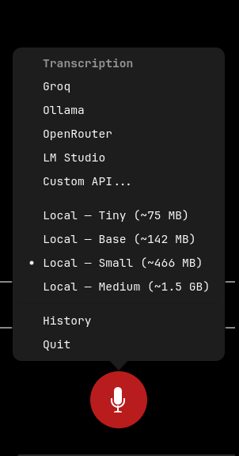

# WhisperCrabs

Floating voice-to-text tool for Linux, macOS, and Windows. 

Click to record, click to transcribe, text copied to clipboard. Setup customized commands to hit record and stop. Play sound when transcription ready. 

Supports fully local transcription via whisper.cpp or any OpenAI-compatible API endpoint (Groq, Ollama, OpenRouter, LM Studio, LocalAI, etc.).

**AI Agent-Ready** — fully controllable via D-Bus. 

Works with [OpenCrabs](https://github.com/adolfousier/opencrabs), [OpenClaw](https://github.com/openclaw/openclaw), and any AI agent that can run shell commands. 

Simple setup: download binary, launch, switch provider via D-Bus.


## Privacy

WhisperCrabs has no account, no telemetry, and no background processes. Your microphone is **never accessed** until you explicitly click the record button. Audio is captured in-memory, never written to disk. Only the transcribed text is stored locally in SQLite on your machine.

With **local mode** (`PRIMARY_TRANSCRIPTION_SERVICE=local`), everything stays on your machine - no network requests at all. With **API mode** (`PRIMARY_TRANSCRIPTION_SERVICE=api`), audio is sent to your configured endpoint (Groq by default, but can point to a local Ollama/LM Studio instance too).

## Features

- Floating microphone button (draggable, position persists)
- One-click voice recording with visual feedback (red idle, green recording, orange transcribing)
- **One-click provider switching** via right-click menu — Groq, Ollama, OpenRouter, LM Studio, Custom API, or Local
- **Multiple local model sizes** — Tiny, Base, Small, Medium (auto-download, auto-cleanup on switch)
- **Custom API dialog** — connect to any OpenAI-compatible endpoint with Base URL, API Key, and Model
- Global keyboard shortcuts via D-Bus (works on GNOME, KDE, Sway, etc.)
- Local transcription via whisper.cpp (no internet required)
- API transcription via any OpenAI-compatible endpoint
- Transcribed text copied to clipboard automatically
- Provider and model choice persists across restarts (saved to DB)
- SQLite history with right-click access
- AI Agent-Ready: full D-Bus control for provider switching, custom API setup, recording
- No background mic access — recording only on explicit click
- Audio stays in-memory, never saved to disk

### Right-Click Menu

Right-click the button to switch transcription provider or local model size:



### Provider Presets

| Provider | Base URL | Default Model | API Key |
|----------|----------|---------------|---------|
| Groq | `https://api.groq.com/openai/v1` | `whisper-large-v3-turbo` | Required |
| Ollama | `http://localhost:11434/v1` | `whisper` | Not needed |
| OpenRouter | `https://openrouter.ai/api/v1` | `openai/whisper-1` | Required |
| LM Studio | `http://localhost:1234/v1` | `whisper-1` | Not needed |
| Custom API... | User-configured | User-configured | Optional |

## Quick Install

Download the pre-built binary from the [latest release](https://github.com/adolfousier/whispercrabs/releases) and run it. No build tools or Rust toolchain needed.

**Linux (x86_64 / aarch64):**
```bash
gh release download --repo adolfousier/whispercrabs --pattern 'whispercrabs-*-linux-x86_64.tar.gz'
tar xzf whispercrabs-*-linux-x86_64.tar.gz
chmod +x whispercrabs
./whispercrabs
```

**macOS (Apple Silicon):**
```bash
gh release download --repo adolfousier/whispercrabs --pattern 'whispercrabs-*-macos-aarch64.tar.gz'
tar xzf whispercrabs-*-macos-aarch64.tar.gz
chmod +x whispercrabs
./whispercrabs
```

**Windows (x86_64):**
```powershell
gh release download --repo adolfousier/whispercrabs --pattern 'whispercrabs-*-windows-x86_64.zip'
Expand-Archive whispercrabs-*-windows-x86_64.zip -DestinationPath .
.\whispercrabs.exe
```

**For local mode**: right-click the button and select a local model size (Tiny, Base, Small, Medium) — downloads automatically.

**For API mode**: right-click and select a provider (Groq, OpenRouter, etc.) — enter your API key when prompted. Or set it via `.env`:
```bash
echo 'API_KEY=your-api-key-here' > .env
```

### Runtime requirements

- **GTK 4** runtime libraries (pre-installed on GNOME desktops; bundled in Windows release ZIP; `brew install gtk4` on macOS)
- Working microphone

> **AI Agent note**: WhisperCrabs is fully controllable via D-Bus from the command line. An AI agent can set up WhisperCrabs for a user by: (1) downloading the binary from a GitHub release, (2) writing a `.env` with the user's API key, (3) launching the binary, and (4) switching transcription mode via D-Bus — no build step required. See the [D-Bus Control](#d-bus-control) section for all available commands.

## Build from Source

### System packages

**Debian/Ubuntu:**
```bash
sudo apt install libgtk-4-dev libgraphene-1.0-dev libvulkan-dev libasound2-dev cmake libclang-dev
```

**Arch Linux:**
```bash
sudo pacman -S gtk4 graphene vulkan-icd-loader alsa-lib cmake clang
```

### Build tools

- [just](https://github.com/casey/just) (optional, for convenient commands)

### Build & run

1. Clone the repository:
   ```bash
   git clone https://github.com/adolfousier/whispercrabs.git
   cd whispercrabs
   ```

2. Build and run:

   **Local mode** (downloads model automatically on first run):
   ```bash
   just run-local
   ```

   **With a different model:**
   ```bash
   just run-local ggml-small.en.bin
   ```

   **API mode** (requires `API_KEY` in `.env`):
   ```bash
   just run-api
   ```

   **Without just** (manual setup):
   ```bash
   # Download a whisper model for local mode
   mkdir -p ~/.local/share/whispercrabs/models
   curl -L -o ~/.local/share/whispercrabs/models/ggml-base.en.bin \
     https://huggingface.co/ggerganov/whisper.cpp/resolve/main/ggml-base.en.bin

   # Set backend in .env
   # PRIMARY_TRANSCRIPTION_SERVICE=local  (or api)

   cargo build --release
   cargo run --release
   ```

### Available whisper models

Models are downloaded from [HuggingFace (ggerganov/whisper.cpp)](https://huggingface.co/ggerganov/whisper.cpp). Run `just list-models` to see options.

| Model | Size | Speed | Notes |
|-------|------|-------|-------|
| `ggml-tiny.en.bin` | ~75MB | Fastest | English only |
| `ggml-base.en.bin` | ~142MB | Fast | English only (default) |
| `ggml-small.en.bin` | ~466MB | Medium | English only, better accuracy |
| `ggml-medium.en.bin` | ~1.5GB | Slow | English only, high accuracy |
| `ggml-large-v3.bin` | ~3.1GB | Slowest | Multilingual, best accuracy |

## Usage

| Action | What happens |
|---|---|
| **Left-click** | Start recording (button turns green with pulse) |
| **Left-click again** | Stop recording, transcribe, copy to clipboard |
| **Esc** (when focused) | Stop recording |
| **Right-click** | Popover menu: switch provider (Groq/Ollama/OpenRouter/LM Studio/Custom/Local), History, Quit |
| **Drag** | Move the button anywhere on screen |

After transcription completes, the text is copied to your clipboard. Paste with **Ctrl+V** wherever you need it.

### Sound notification

Play an audio cue when transcription completes:

```env
SOUND_NOTIFICATION_ON_COMPLETION=true
```

This is especially useful with local models that may take a few seconds to transcribe. You can keep working in another window, hear the notification when it's done, and just Ctrl+V to paste.

## D-Bus Control

WhisperCrabs exposes D-Bus actions for full CLI control. Bind these to keyboard shortcuts, use them from scripts, or call them from an AI agent.

**Start recording** (raises window and begins recording):
```bash
gdbus call --session --dest=dev.whispercrabs.app --object-path=/dev/whispercrabs/app --method=org.gtk.Actions.Activate record [] {}
```

**Stop recording** (stops recording and triggers transcription):
```bash
gdbus call --session --dest=dev.whispercrabs.app --object-path=/dev/whispercrabs/app --method=org.gtk.Actions.Activate stop [] {}
```

**Switch to a provider** (e.g. Groq, Ollama, OpenRouter, LM Studio):
```bash
# Switch to Groq
gdbus call --session --dest=dev.whispercrabs.app --object-path=/dev/whispercrabs/app --method=org.gtk.Actions.Activate transcription-mode "[<'groq'>]" {}

# Switch to Ollama (local API, no key needed)
gdbus call --session --dest=dev.whispercrabs.app --object-path=/dev/whispercrabs/app --method=org.gtk.Actions.Activate transcription-mode "[<'ollama'>]" {}

# Switch to OpenRouter
gdbus call --session --dest=dev.whispercrabs.app --object-path=/dev/whispercrabs/app --method=org.gtk.Actions.Activate transcription-mode "[<'openrouter'>]" {}

# Switch to LM Studio
gdbus call --session --dest=dev.whispercrabs.app --object-path=/dev/whispercrabs/app --method=org.gtk.Actions.Activate transcription-mode "[<'lmstudio'>]" {}
```

**Switch to local mode** (auto-downloads model if missing, choose size):
```bash
# Local Base model (~142 MB, default)
gdbus call --session --dest=dev.whispercrabs.app --object-path=/dev/whispercrabs/app --method=org.gtk.Actions.Activate transcription-mode "[<'local-base'>]" {}

# Local Tiny (~75 MB), Small (~466 MB), or Medium (~1.5 GB)
gdbus call --session --dest=dev.whispercrabs.app --object-path=/dev/whispercrabs/app --method=org.gtk.Actions.Activate transcription-mode "[<'local-tiny'>]" {}
gdbus call --session --dest=dev.whispercrabs.app --object-path=/dev/whispercrabs/app --method=org.gtk.Actions.Activate transcription-mode "[<'local-small'>]" {}
gdbus call --session --dest=dev.whispercrabs.app --object-path=/dev/whispercrabs/app --method=org.gtk.Actions.Activate transcription-mode "[<'local-medium'>]" {}
```

**Set custom API endpoint** (programmatic, no dialog):
```bash
gdbus call --session --dest=dev.whispercrabs.app --object-path=/dev/whispercrabs/app \
  --method=org.gtk.Actions.Activate set-api-config \
  "[<'{\"base_url\":\"http://localhost:11434/v1\",\"model\":\"whisper\"}'>]" {}

# With API key:
gdbus call --session --dest=dev.whispercrabs.app --object-path=/dev/whispercrabs/app \
  --method=org.gtk.Actions.Activate set-api-config \
  "[<'{\"base_url\":\"https://api.example.com/v1\",\"api_key\":\"sk-...\",\"model\":\"whisper-1\"}'>]" {}
```

### Keyboard Shortcuts

These D-Bus commands work on **GNOME, KDE, Sway, Hyprland, i3**, and any DE that supports custom shortcuts.

### GNOME

Settings > Keyboard > Custom Shortcuts:

| Name | Command | Suggested shortcut |
|------|---------|-------------------|
| WhisperCrabs Record | `gdbus call --session --dest=dev.whispercrabs.app --object-path=/dev/whispercrabs/app --method=org.gtk.Actions.Activate record [] {}` | Alt+Shift+R |
| WhisperCrabs Stop | `gdbus call --session --dest=dev.whispercrabs.app --object-path=/dev/whispercrabs/app --method=org.gtk.Actions.Activate stop [] {}` | Alt+Shift+S |

### KDE Plasma

System Settings > Shortcuts > Custom Shortcuts > Edit > New > Global Shortcut > Command/URL. Add the same `gdbus` commands above.

### Sway / Hyprland / i3

Add to your config:
```
# Sway / i3
bindsym Alt+Shift+r exec gdbus call --session --dest=dev.whispercrabs.app --object-path=/dev/whispercrabs/app --method=org.gtk.Actions.Activate record [] {}
bindsym Alt+Shift+s exec gdbus call --session --dest=dev.whispercrabs.app --object-path=/dev/whispercrabs/app --method=org.gtk.Actions.Activate stop [] {}

# Hyprland
bind = ALT SHIFT, R, exec, gdbus call --session --dest=dev.whispercrabs.app --object-path=/dev/whispercrabs/app --method=org.gtk.Actions.Activate record [] {}
bind = ALT SHIFT, S, exec, gdbus call --session --dest=dev.whispercrabs.app --object-path=/dev/whispercrabs/app --method=org.gtk.Actions.Activate stop [] {}
```

## Compatible API Backends

Any service exposing an OpenAI-compatible `/v1/audio/transcriptions` endpoint works. Set `API_BASE_URL`, `API_KEY`, and `API_MODEL` in your `.env`:

**Groq (default, no config needed):**
```env
PRIMARY_TRANSCRIPTION_SERVICE=api
API_KEY=gsk_...
```

**Ollama (local, no API key needed):**
```env
PRIMARY_TRANSCRIPTION_SERVICE=api
API_BASE_URL=http://localhost:11434/v1
API_KEY=unused
API_MODEL=whisper
```

**OpenRouter:**
```env
PRIMARY_TRANSCRIPTION_SERVICE=api
API_BASE_URL=https://openrouter.ai/api/v1
API_KEY=sk-or-...
API_MODEL=openai/whisper-1
```

**LM Studio:**
```env
PRIMARY_TRANSCRIPTION_SERVICE=api
API_BASE_URL=http://localhost:1234/v1
API_KEY=unused
API_MODEL=whisper-1
```

## Stack

| Component | Crate/Tool |
|-----------|-----------|
| GUI | gtk4-rs (GTK 4) |
| Audio | cpal + hound |
| Local STT | whisper-rs (whisper.cpp) + rubato |
| API STT | reqwest + OpenAI-compatible API |
| Database | rusqlite (bundled SQLite) |
| Clipboard | arboard |
| Config | dotenvy |

## License

MIT - see [LICENSE](LICENSE)
